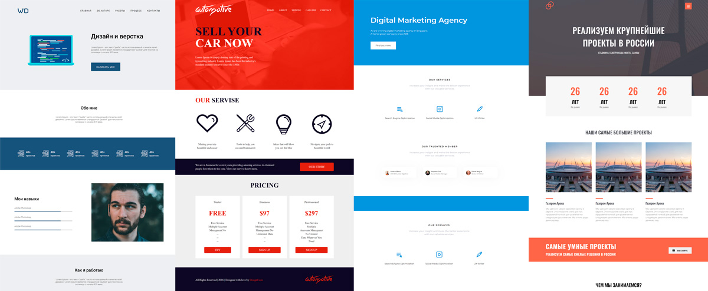

## Привет, меня зовут Владислав 👋

### *Что я делаю?*
Я изучаю веб разработку, язык разметки, стили, языки веб программирования.  Это очень интересное направление, и у него нет границ. Можно двигаться в этом направлении бесконечно, и ты никогда не исчерпаешь всю ту информацию которая уже есть, а ведь интернет технологии развиваются гигантскими шагами, и с каждым днём этой информации становится больше и больше...

### *Зачем мне это надо?*
Я занимаюсь этим потому что мне это интересно!!  Мне интересно как работает интернет изнутри. Как устроены страницы, сайты, сервисы и различные приложения которые работают в сети.

### *Что изучаю, что использую и что изучено?*
     
   

### *Мои работы:* 

Здесь по ссылкам можно посмотреть работы на которых я практикуюсь и прохожу обучение, по мере получения новых знаний я стараюсь их дорбатывть и улучшать:
* [Automotive](https://vsamura.github.io/Automotive/)   
* [The largest projects in Russia](https://vsamura.github.io/PracticFigmaSite/)
* [Design and layout](https://vsamura.github.io/Design-and-layout/)
* [Digital Marketing Agency](https://vsamura.github.io/Digital-Marketing-Agency/)
* [Partner with Konstuct](https://vsamura.github.io/Partner-with-Konstuct/)
* [Alivio](https://vsamura.github.io/Alivio/)

### *Моя статистика*   
  
  
  
### *Контакты*  

   

***
 

